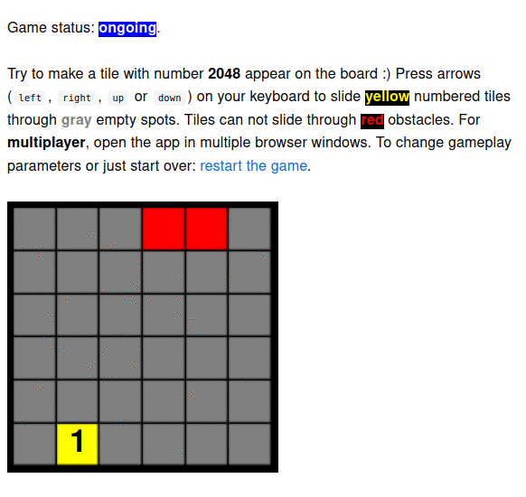

# Game2048

Just another implementation of [2048](https://en.wikipedia.org/wiki/2048_(video_game)) game.

:tada: Specific functionalities for this implementation:

- configurable grid size,
- optional obstacles on the grid for ambitious players,
- multiplayer gameplay (you can play the same game on multiple web browser windows).

:construction: What is missing?
- the user interface is not polished and **lack of animation when sliding tiles makes it difficult to follow the game**,
- playing multiple independent games at the same time on a single server is currently not supported.

## :fast_forward: Demo

<kbd></kbd>

## :orange_book: Documentation

### :speech_balloon: Game rules & language used in the project

The game is played on a ***grid***.
Grid consists of ***rows*** (and ***columns***).
Each row (or column) has ***spots***.

A spot can be ***empty*** or contain an ***element*** (***obstacle*** or ***tile***).
The tiles have numbers on them.

The player's ***move*** consists in ***sliding*** the tiles in one of four ***directions*** (***left***, ***right***,
***up*** or ***down***).
Tiles slide as far as possible in the chosen direction until they are stopped by either another tile, obstacle, or the
edge of the grid.
If two tiles of the same number collide while moving, they will ***merge*** into a tile with the total value of the two
tiles that collided. The resulting tile cannot merge with another tile again in the same move.
If a move causes three consecutive tiles of the same value to slide together, the two tiles farthest along the
direction of motion will combine.

On every move, a new tile randomly appears in an empty spot on the grid with a value of `1`.

The game is ***won*** when a tile with a value of `2048` appears on the grid.
Players can not continue the game beyond that.

When no ***legal move*** can be made (the player is unable to slide any more tiles), the player ***loses*** the game.

### :rocket: Running the app

To start your Phoenix server:

  * Install dependencies with `mix deps.get`
  * Start Phoenix endpoint with `mix phx.server` or inside IEx with `iex -S mix phx.server`

Now you can visit [`localhost:4000`](http://localhost:4000) from your browser.

Ready to run in production? Please [check our deployment guides](https://hexdocs.pm/phoenix/deployment.html).

## :scroll: Copyright and license

See the [LICENSE](LICENSE).
